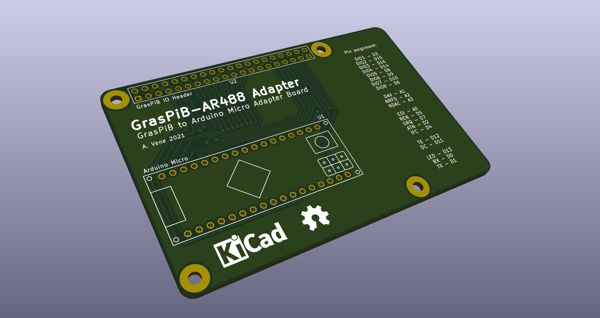

# GrasPiB Arduino Micro adapter

A simple adapter board for connecting the GrasPiB Raspberry Pi hat to an Arduino Micro running the [AR488 firmware](https://github.com/Twilight-Logic/AR488).



## AR488 configuration

Pin assignment is compatible with the default AR488, except for the TE and DC control signals for the SN7516x bus drivers, which need to be enabled in the [`AR488_Config.h`](https://github.com/Twilight-Logic/AR488/blob/db879376f8afdc95d7bf1696cdb96f927a3bf9c9/src/AR488/AR488_Config.h) file.

In the `AR488_Config.h` config file, search for the `Enable SN7516x chips` section and modify it as follows:

```
/***** Enable SN7516x chips *****/
/*
 * Uncomment to enable the use of SN7516x GPIB tranceiver ICs.
 * This will require the use of an additional GPIO pin to control
 * the read and write modes of the ICs.
 */
#define SN7516X
#ifdef SN7516X
  #define SN7516X_TE 12
  #define SN7516X_DC 11
  //#define SN7516X_SC 12
#endif
```

No other modifications should be needed to use GrasPiB with an Arduino and AR488 software.

## Signal mapping

```
GrasPiB - AR488

   DIO1 - D3
   DIO2 - D15
   DIO3 - D16
   DIO4 - D14
   DIO5 - D8
   DIO6 - D9
   DIO7 - D10
   DIO8 - D6

    DAV - A1
   NRFD - A2
   NDAC - A3

    EOI - A0
    REN - D5
    SRQ - D7
    ATN - D2
    IFC - D4

     TE - D12
     DC - D11

    LED - D13
     RX - D0
     TX - D1
```
