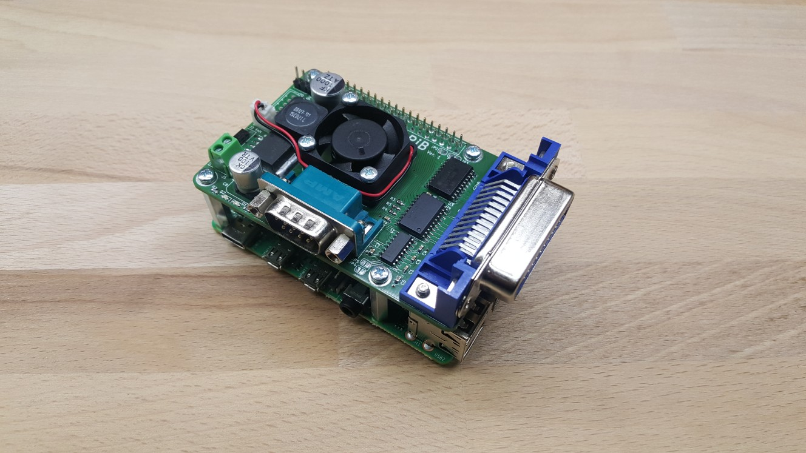

# GrasPiB
GPIB interface board for Raspberry Pi, designed to work with [linux-gpib](https://linux-gpib.sourceforge.io/) gpio bitbang driver. Extra features include: RS232 serial interface, voltage regulator, fan mount and I2C conector.



## Features
* Active GPIB interface circuit using SN7516x bus driver ICs
* RS232 serial interface (MAX3232 level converter), with optionally configurable RTS and CTS lines
* Step down voltage regulator (LM2576) for use with higher voltage power supplies (7-35VDC)
* 25mm cooling fan mounting holes and 2pin JST-PH connector for power
* I2C break out connector with one extra GPIO line (5pin JST-PH connector)
* Stacks on top of a Raspberry Pi

## Configuration options

**JP7 Power supply selection:**

* Close pins 1-2: Power from J5 screw terminal trough onboard regulator circuit (7-35VDC input)
* Close pins 2-3: Power from J5 screw terminal bypassing onboard regulator circuit (5VDC input only !!)
* Leave Open: Power from Raspberry Pi power input USB connector, GrasPiB regulator circuit is isolated

**JP6 Output Voltage select on I2C breakout connector**

* Close pins 1-2: 3,3V on J4 pin 1
* Close pins 2-3: 5V on J4 pin 1

**Enabling RS232 CTS and RTS lines:**

* Close jumpers JP1, JP2, JP4 and JP5, open JP3 positions 1-2 and close positions 2-3
* This change also needs the GPIB DIO3 signal to be reassigned from GPIO16 to GPIO21 (linux-gpib driver code modifications needed)

## Linux-gpib setup instructions

(following instructions were tested on a fresh Raspberry Pi OS Lite image)

0. Setup and configure OS on Raspberry Pi
    * Do as you would with a fresh OS image (passwords, networking, services, communication ports...)

1. Install build tools and dependencies
    * Build tools: `$ sudo apt install build-essential autoconf automake libtool flex bison`
    * RPi kernel headers: `$ sudo apt install raspberrypi-kernel-headers`
    * Python3 headers: `$ sudo apt install python3-dev`

2. Download linux-gpib source files
    * Get release archives (4.3.4 or later) from [https://sourceforge.net/projects/linux-gpib/files](https://sourceforge.net/projects/linux-gpib/files)
    * or get the latest source from [https://sourceforge.net/p/linux-gpib/code/HEAD/tree/](https://sourceforge.net/p/linux-gpib/code/HEAD/tree/)

3. Build and install kernel drivers
    * Enter linux-gpib-kernel directory `$ cd linux-gpib-src-dir/linux-gpib-kernel`
    * Build kernel module by running make `$ make`
    * Install kernel module `$ sudo make install`
    * Update kernel module list `$ sudo depmod -a`
    * Load gpib_bitbang kernel module `$ sudo modprobe gpib_bitbang`
    * Now there should be some `gpib*` devices in `/dev`
    * Make the module loads on boot by adding `gpib_bitbang` line to `/etc/modules-load.d/modules.conf`

**When Raspberry Pi OS kernel gets upgraded, linux-gpib kernel module also needs to be rebuilt and reinstalled.**
Basically just repeat above `make` and `make install` steps when kernel gets upgraded...

4. Build and install user space tools
    * Enter linux-gpib-user directory: `$ cd linux-gpib-src-dir/linux-gpib-user`
    * If building from svn checkout first run bootstrap script: `$ ./bootstrap`
    * Run configure script: `$ ./configure` (run `$ ./configure --help` to list additional options)
    * Build user space tools by running make: `$ make`
    * Install user space tools: `$ sudo make install`
    * Make sure that shared library directory (default: `/usr/local/lib/`) is listed in: `/etc/ld.so.conf.d/`
    * Then run: `$ sudo ldconfig`

5. Configure GPIB interface
    * Open gpib.conf configuration file `$ sudo nano /usr/local/etc/gpib.conf` (default location)
    * Set `board_type = "gpib_bitbang"` and other relevant settings (for details refer to included [`gpib.conf`](extra/gpib.conf) file, [linux-gpib documentetion](https://linux-gpib.sourceforge.io/doc_html/configuration-gpib-conf.html) and included template file `linux-gpib-src-dir/linux-gpib-user/util/template/gpib.conf`)
    * Run gpib_config so the driver reads the configuration file `$ sudo gpib_config --minor 0`
    * Make the last command execute on every startup using crontab entry:
        - Edit crontab for root user: `$ sudo crontab -e`
        - Add line the following line to cron tab file: `@reboot /usr/local/sbin/gpib_config --minor 0`

6. Enable non root users to use GPIB interface without sudo
    - Add new `gpib` system group: `$ sudo groupadd -r gpib`
    - Append your_user_name to `gpib` supplementary group: `$ sudo usermod -a -G gpib your_user_name`
    - Create [`/etc/udev/rules.d/99-gpib.rules`](extra/99-gpib.rules) file and add line: `SUBSYSTEM=="gpib_common", GROUP="gpib", MODE="0660"`
    - Reboot system to apply changes (udevadm utility can also be used, but reboot is dead simple to remember)
    - Test by running `ibtest` without sudo

Above instructions should result in an environment with a functional GPIB interface, C headers and python bindings, ready for use.

## Enabling RS232 Hardware flow control

### Hardware setup:

On the Raspberry Pi CTS and RTS signals are mapped to pins GPIO16 and GPIO17. By default, linux-gpib bitbang driver uses GPIO16 for GPIB DIO3 signal. In order to free up GPIO16, the DIO3 signal can be rewired to GPIO21 by **opening** positions **1-2** (cut traces between pads) and **closing** positions **2-3** on the solder jumper JP3.

By default, CTS and RTS signals are disconnected from the RS232 level converter chip. To connect the CTS and RTS lines, solder jumpers **JP1**, **JP2**, **LP4** and **JP5** need to be **closed**.

Note also, that the extra GPIO17 line on the I2C break out connector J4 can't be used for other purposes when system is configured for RS232 hardware flow control.

### Software setup:

1. Because GPIB signal DIO3 was rewired in hardware to GPIO21, this change needs to reflected in the linux-gpib bitbang driver source code. The source file in question is: `[linux-gpib-sorce-dir]/linux-gpib-kernel/drivers/gpib/gpio/gpib_bitbang.c`, where the signal pairing section needs to be modified as shown below. With the modification done, the linux-gpib driver needs to be compiled as described in step 3 of the "Linux-gpib setup instructions" section of this document.

```
/**********************************************
 *  Signal pairing and pin wiring between the *
 *  Raspberry-Pi connector and the GPIB bus   *
 *                                            *
 *               signal           pin wiring  *
 *            GPIB  Pi-gpio     GPIB  ->  RPi *
**********************************************/
typedef enum {
        D01_pin_nr =  20,     /*   1  ->  38  */
        D02_pin_nr =  26,     /*   2  ->  37  */
//      D03_pin_nr =  16,     /*   3  ->  36  ORIGINAL AND COMMENTED OUT */
        D03_pin_nr =  21,     /*   3  ->  40  MODIFIED TO AVOID CONFLICT WITH CTS SIGNAL */
        D04_pin_nr =  19,     /*   4  ->  35  */
        D05_pin_nr =  13,     /*  13  ->  33  */
        D06_pin_nr =  12,     /*  14  ->  32  */
        D07_pin_nr =   6,     /*  15  ->  31  */
        D08_pin_nr =   5,     /*  16  ->  29  */
        EOI_pin_nr =   9,     /*   5  ->  21  */
        DAV_pin_nr =  10,     /*   6  ->  19  */
        NRFD_pin_nr = 24,     /*   7  ->  18  */
        NDAC_pin_nr = 23,     /*   8  ->  16  */
        IFC_pin_nr =  22,     /*   9  ->  15  */
        SRQ_pin_nr =  11,     /*  10  ->  23  */
        _ATN_pin_nr = 25,     /*  11  ->  22  */
        REN_pin_nr =  27,     /*  17  ->  13  */
...

```

2. Next the [`uart-ctsrts.dtbo`](extra/uart-ctsrts.dtbo) file (included in extra directory) needs to be copied in to the `/boot/overlays` directory and add the following lines need to be added to the `/boot/config.txt` file:

```
enable_uart=1
dtoverlay=disable-bt
dtoverlay=uart-ctsrts
```

3. Reboot the system to apply changes.
